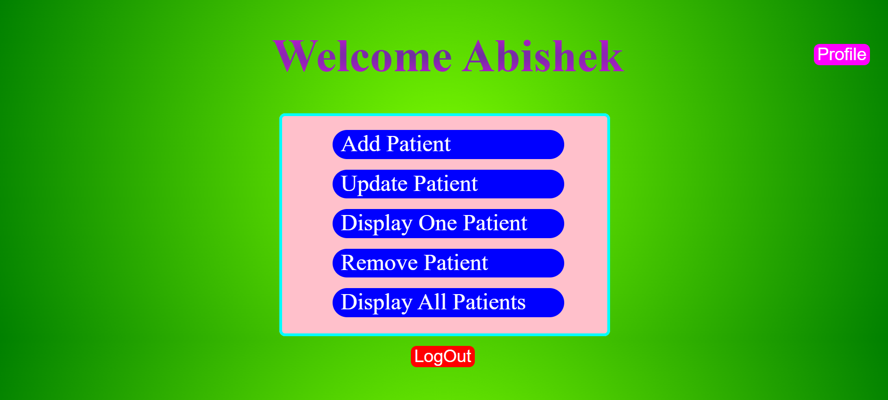
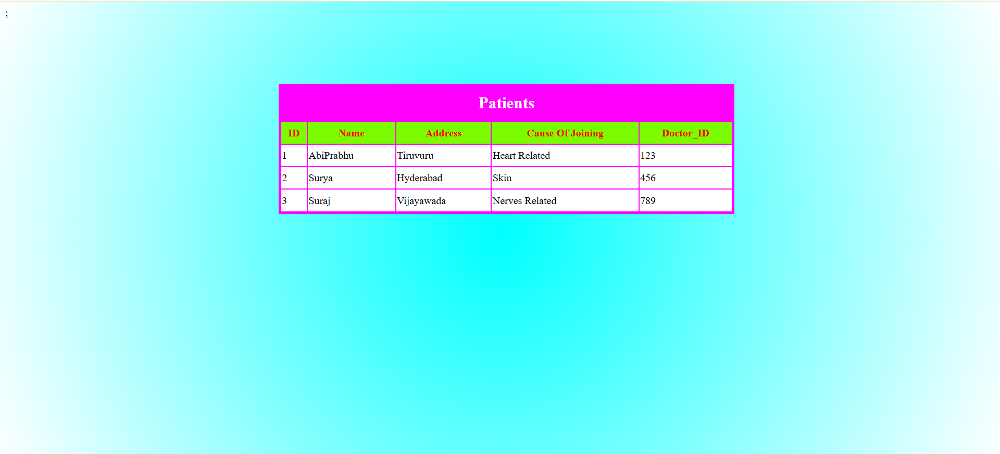

# Hospital Management System

## 📌 Project Overview
Hospital Management System is a Java Web Application developed using JSP, HTML, CSS, Hibernate, and MySQL.  
This system helps manage hospital operations such as patient records, doctor details, login and CRUD operations.

---

## 🚀 Technologies Used
- Java
- JSP
- HTML & CSS
- Hibernate
- MySQL
- Maven
- Apache Tomcat

---

## 💻 Features
- Add / Update / Delete Patients
- Doctor Management
- Appointment Scheduling
- Database Integration using Hibernate
- User-friendly Interface

---

## 🛠️ How to Run the Project
1. Clone the repository
2. Import into Eclipse as Maven Project
3. Configure MySQL database
4. Update `hibernate.cfg.xml`
5. Run on Apache Tomcat Server

---

## 📷 Project Screenshots

## 👤 Author
Abishek Prabhu Nadh

